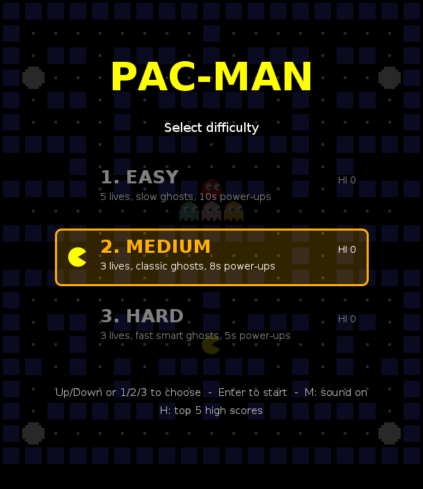
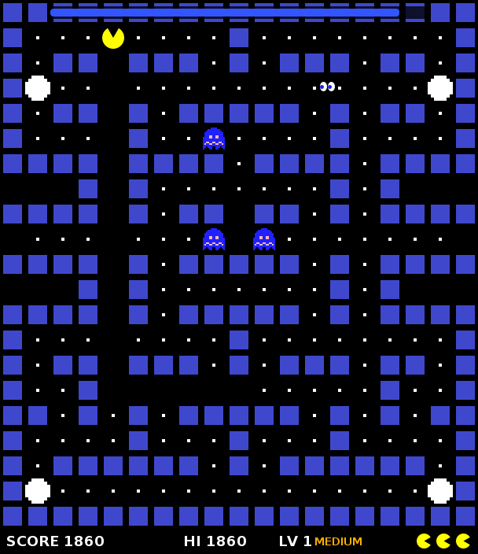
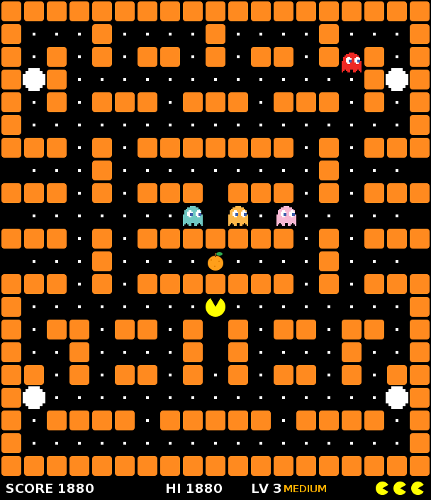
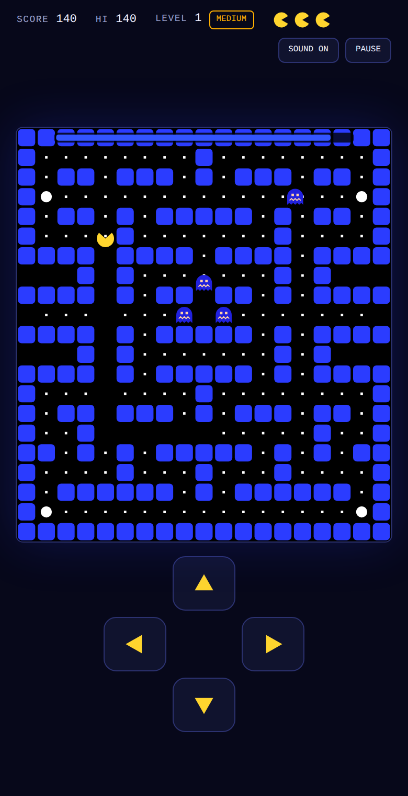

<div align="center">

# 🟡 Pac-Man

**A complete Pac-Man arcade game written in Java Swing, plus a browser version you can play on a phone.**


<br>

<table>
  <tr>
    <td align="center"><br><sub>Start menu</sub></td>
    <td align="center"><br><sub>Power pellet: frightened ghosts, eyes and timer bar</sub></td>
  </tr>
  <tr>
    <td align="center"><br><sub>Level 3: the Tunnels maze</sub></td>
    <td align="center"><br><sub>Browser version on a phone</sub></td>
  </tr>
</table>

</div>

---

## Contents

- [Features](#features)
- [Quick start](#quick-start)
- [Controls](#controls)
- [How to play](#how-to-play)
- [Project structure](#project-structure)
- [How it works](#how-it-works)
- [Make your own maze](#make-your-own-maze)
- [සිංහලෙන්](#සිංහලෙන්)

---

## Features

| | |
| --- | --- |
| 🎮 **Classic gameplay** | Pellets, power pellets, side tunnels, frightened ghosts, lives and levels |
| 👻 **Four ghost personalities** | Each ghost hunts you differently, and they switch between chasing and scattering |
| 👀 **Ghost eyes** | An eaten ghost turns into eyes that race home along the shortest path, then revive |
| 🗺️ **Four mazes** | Classic, Arena, Tunnels and Cross, each with its own wall colour |
| 🍒 **Six bonus fruits** | A new fruit every level, from Cherry (100) to Grapes (2000) |
| 🎚️ **Three difficulties** | Easy, Medium and Hard change lives, ghost speed, ghost smarts and power-up time |
| 🏆 **Top 5 high scores** | Enter your name when you make the table; each difficulty has its own |
| ❤️ **Extra life** | One bonus life at 10,000 points |
| ⏱️ **Power-up timer** | A bar shows how long the ghosts stay frightened and flashes before it ends |
| 🔊 **Retro sound** | Every sound effect is generated in code, so there are no audio files |
| 🌐 **Browser version** | Same game in a single HTML file, with swipe and d-pad controls for phones |

---

## Quick start

### Desktop (Java)

You need a **Java JDK 11 or newer**. Get it free from [adoptium.net](https://adoptium.net).

| System | How to start |
| --- | --- |
| **Windows** | Double-click **`run.bat`** |
| **macOS / Linux** | Run **`./run.sh`** in a terminal |
| **VS Code** | Open the `Pacman` folder with the *Extension Pack for Java* and run `App.java` |

Both scripts compile the game and start it. You can also do it by hand:

```sh
cd Pacman/src
javac *.java
java App
```

### Browser (no Java needed)

Open **`web/index.html`** in any modern browser, either by double-clicking it or by hosting the
`web` folder (for example with GitHub Pages). It plays the same as the Java version. On a phone you
steer by swiping on the maze or with the on-screen pad.

---

## Controls

| Key | Action |
| --- | --- |
| **Arrow keys** or **W A S D** | Move. Turns are buffered, so press just before a corner |
| **1 / 2 / 3** | Start on Easy / Medium / Hard from the menu |
| **Enter** | Start the selected difficulty, or go back to the menu after game over |
| **H** | Show the top 5 high scores (from the menu) |
| **P** or **Esc** | Pause / resume |
| **Q** (while paused) | Quit to the menu |
| **M** | Sound on / off |
| **Swipe** or **on-screen pad** | Move (browser version on touch screens) |

---

## How to play

Eat every pellet in the maze to clear the level, and don't let a ghost catch you.
Eat a **power pellet** (the big white dots in the corners) and the ghosts turn blue and run away.
That's your chance to eat them.

### Scoring

| Item | Points |
| --- | ---: |
| Pellet | 10 |
| Power pellet | 50 |
| Ghosts eaten in a row on one power pellet | 200 → 400 → 800 → 1600 |
| Bonus fruit | 100 to 2000 (see below) |
| **Extra life** | awarded once at **10,000** |

### Bonus fruit

A fruit appears twice per level (after 70 and 140 pellets) and stays for 10 seconds.

| Level | Fruit | Points |
| :---: | --- | ---: |
| 1 | 🍒 Cherry | 100 |
| 2 | 🍓 Strawberry | 300 |
| 3 | 🍊 Orange | 500 |
| 4 | 🍎 Apple | 700 |
| 5 | 🍈 Melon | 1000 |
| 6+ | 🍇 Grapes | 2000 |

### Difficulty

| Mode | Lives | Ghosts | Power-up time |
| --- | :---: | --- | :---: |
| 🟢 **Easy** | 5 | Slow, and often take a random turn | 10 s |
| 🟠 **Medium** | 3 | Classic speed and behaviour | 8 s |
| 🔴 **Hard** | 3 | Fast, and rarely make a mistake | 5 s |

Ghosts also get a little faster every level.

### Meet the ghosts

| Ghost | Colour | How it hunts you |
| --- | --- | --- |
| **Blinky** | 🔴 Red | Chases you directly |
| **Pinky** | 🩷 Pink | Aims four tiles ahead of where you're going, to cut you off |
| **Inky** | 🩵 Cyan | Flanks you, using Blinky's position to trap you between them |
| **Clyde** | 🟠 Orange | Chases you from afar, but backs off to his corner when he gets close |

Every so often all four stop chasing and **scatter** to their own corners for a few seconds.
That's a good moment to clear a crowded area.

### Mazes

The levels cycle through four mazes: **Classic** (blue) → **Arena** (purple) → **Tunnels** (orange) → **Cross** (green) → back to Classic.
The side exits of a maze are tunnels that wrap around to the other side.

### High scores

If your final score makes the top 5 for your difficulty, you're asked for your name.

- **Java version:** saved in your home folder as `.pacman_scores_easy`, `.pacman_scores_medium` and `.pacman_scores_hard`.
- **Browser version:** saved in that browser only.

---

## Project structure

```
pacman/
├── Pacman/
│   └── src/
│       ├── App.java          # Opens the game window
│       ├── PacMan.java       # The game: loop, movement, ghost AI, drawing, menus, input
│       ├── Mazes.java        # The four maze layouts
│       ├── Fruit.java        # Bonus fruit types, points and drawings
│       ├── ScoreBoard.java   # Top 5 high scores per difficulty
│       ├── Sound.java        # Synthesized retro sound effects
│       └── *.png             # Sprites for walls, ghosts, power pellets and the cherry
├── web/
│   └── index.html            # Browser version (one self-contained file)
├── docs/screenshots/         # Images used in this README
├── run.bat                   # Windows launcher (double-click)
├── run.sh                    # macOS / Linux launcher
└── README.md
```

---

## How it works

- **Game loop.** A Swing `Timer` ticks every 25 ms (40 updates a second). Each tick moves everything one step and repaints.
- **Grid movement.** Pac-Man and the ghosts move 4 pixels per step on a 32-pixel grid, so they always pass exactly through the centre of each tile. Turns are only decided at tile centres, which keeps movement clean and makes buffered turns possible.
- **Ghost speed.** Ghosts always step the same distance, and are slowed down by skipping some frames. Difficulty and level control how many frames they skip.
- **Ghost AI.** At every junction a ghost picks the turn that brings it closest to its target tile. Each ghost picks its target differently (see [Meet the ghosts](#meet-the-ghosts)). Frightened ghosts turn randomly.
- **Eyes going home.** When a maze loads, a breadth-first search from each ghost's home tile records the distance from every tile. The eyes just follow those distances downhill, so they always take the shortest way back, tunnels included.
- **Sound.** `Sound.java` builds square-wave samples in memory and plays them through `javax.sound.sampled` on a background thread. If the computer has no audio device, the game keeps running silently.
- **Browser version.** `web/index.html` is a JavaScript port of the same rules, drawn on an HTML canvas, with sound from the Web Audio API. It needs no images or libraries.

---

## Make your own maze

Mazes are plain text in `Pacman/src/Mazes.java`: 21 rows of 19 characters each.

| Character | Meaning |
| :---: | --- |
| `X` | Wall |
| *(space)* | Pellet |
| `*` | Power pellet |
| `O` | Empty floor (no pellet) |
| `P` | Pac-Man's start |
| `F` | Pellet, and the spot where the bonus fruit appears |
| `r` `p` `b` `o` | Start of the red, pink, blue and orange ghost |

Rules for a maze that plays well:

- Every pellet must be reachable from `P`, or the level can never be finished.
- Avoid dead ends.
- A tunnel needs an opening on **both** the left and right edge of the same row.

The browser version keeps its own copy of the mazes (the `MAZES` list in `web/index.html`), so copy any new maze there too.

---

## සිංහලෙන්

**Java ක්‍රීඩාව (Windows):**
1. [adoptium.net](https://adoptium.net) වෙතින් Java JDK install කරන්න.
2. Project folder එකේ තියෙන **`run.bat`** double-click කරන්න.

**Browser ක්‍රීඩාව:** **`web/index.html`** double-click කරන්න. Java ඕනේ නැහැ. Phone එකේ maze එක උඩ swipe කරන්න, නැත්නම් ⬆⬇⬅➡ බොත්තම් ඔබන්න.

**Keys:** ඊතල (arrow) keys හෝ WASD = යන්න · P = pause · M = sound · H = Top 5 scores

**ඉලක්කය:** හැම pellet එකක්ම කාලා level එක ඉවර කරන්න. ලොකු සුදු තිතක් (power pellet) කෑවම ghosts ලා නිල් පාට වෙනවා. එතකොට ඔවුන්වත් කන්න පුළුවන්! 👻
